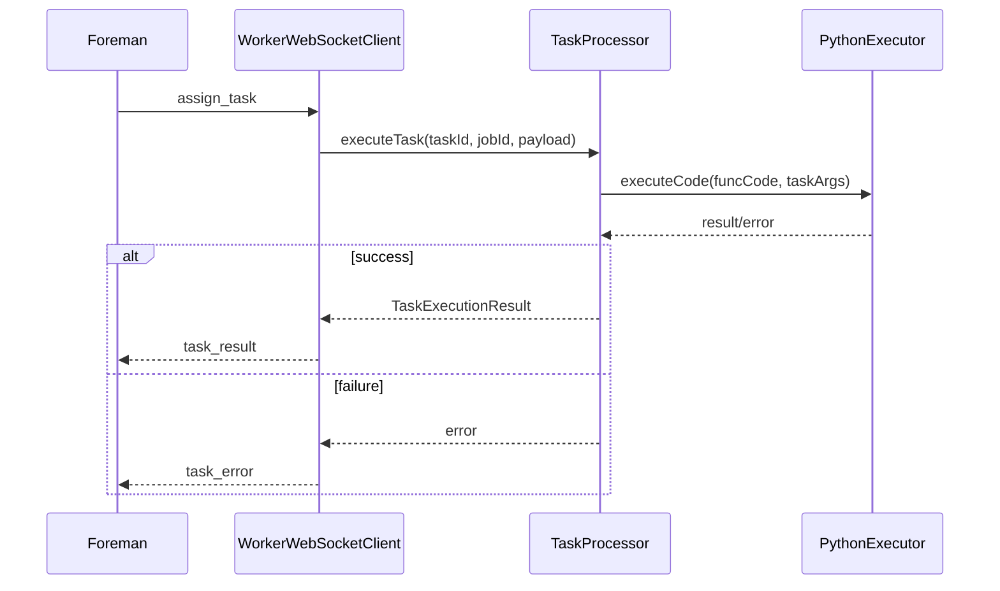
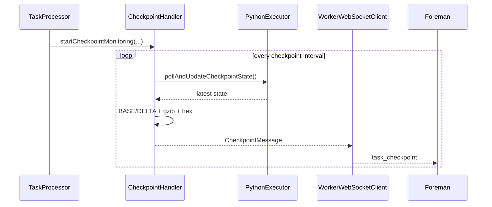
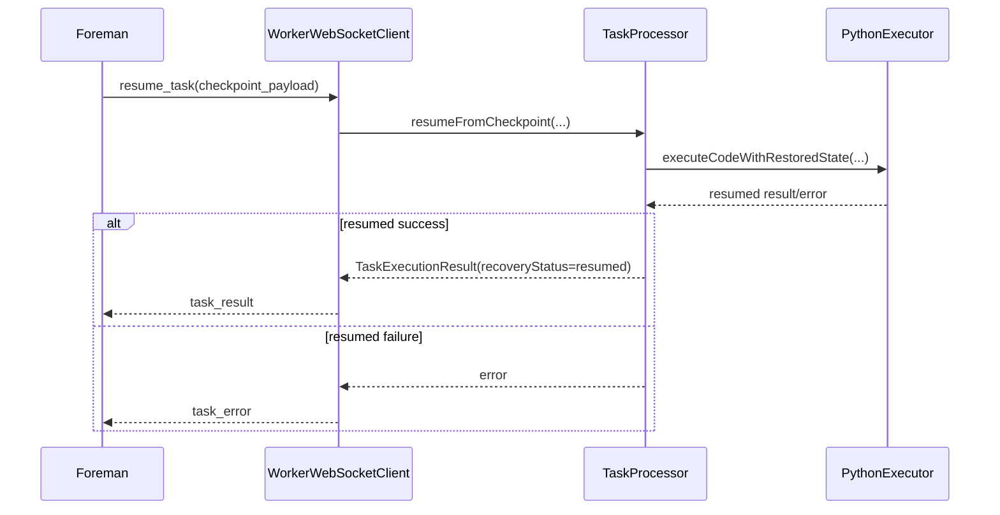

# CROWDio Mobile Worker Architecture

## 1. Project Overview

This Android app has two major responsibilities:

1. Mobile worker runtime for distributed task execution (foreground service + WebSocket + Chaquopy).
2. Monitoring/dashboard client for foreman APIs and worker telemetry.

The codebase is organized around these responsibilities:

- `app/src/main/java/com/example/mcc_phase3/services`: foreground service orchestration.
- `app/src/main/java/com/example/mcc_phase3/communication`: worker WebSocket protocol and reconnection.
- `app/src/main/java/com/example/mcc_phase3/execution`: task routing, Python execution, model artifact flow.
- `app/src/main/java/com/example/mcc_phase3/checkpoint`: checkpoint capture, delta generation, resume support.
- `app/src/main/java/com/example/mcc_phase3/data`: config, IDs, REST clients, dashboard repository.
- `app/src/main/java/com/example/mcc_phase3/ui`: fragments, adapters, and MVI view model/state/event.
- `app/src/main/python`: bundled Python modules executed via Chaquopy.

## 2. Runtime Architecture

### 2.1 Worker execution path

The main worker path is:

`TasksFragment` -> `MobileWorkerService` -> `WorkerWebSocketClient` -> `TaskProcessor` -> `PythonExecutor` -> Chaquopy runtime

Worker pipeline details:

1. User starts worker from `TasksFragment`.
2. `MobileWorkerService` starts as a foreground service (`START_STICKY`) and initializes worker components.
3. `WorkerWebSocketClient` connects to foreman with exponential backoff reconnection.
4. On task assignment, `TaskProcessor` validates and schedules execution.
5. `PythonExecutor` decodes incoming code/args and executes Python using Chaquopy.
6. Result or error is sent back over WebSocket; oversized payloads are uploaded by HTTP and sent as reference metadata.
7. Heartbeats are emitted while connected.

### 2.2 Core worker components

- `MobileWorkerService`
  - Single runtime orchestrator for socket + processor + Python.
  - Exposes worker status and task controls (pause/resume/kill).
  - Maintains persistent notification lifecycle.

- `WorkerWebSocketClient`
  - Handles connection lifecycle, listener callbacks, and heartbeat loop.
  - Routes inbound protocol messages (`assign_task`, `resume_task`, `ping`, `checkpoint_ack`).
  - Sends outbound protocol messages (`worker_ready`, `worker_heartbeat`, `task_result`, `task_error`, `task_checkpoint`, `pong`).

- `TaskProcessor`
  - Implements `TaskExecutor`.
  - Owns task queueing when worker is busy.
  - Configures checkpointing per task metadata.
  - Applies timeout and stage-specific routing/normalization logic.
  - Coordinates model partition resolution through `ModelRepository`.

- `PythonExecutor`
  - Initializes Chaquopy interpreter modules.
  - Executes incoming Python function code (base64/plain text support).
  - Supports checkpoint callbacks and progress callbacks via Python builtins.
  - Supports resume execution by restoring checkpoint state into builtins.
  - Performs mobile substitutions for some heavy sentiment workloads.

- `CheckpointHandler`
  - Periodically polls state and emits BASE/DELTA checkpoints.
  - Serializes state to JSON, compresses with GZIP, and computes deltas.
  - Preserves checkpoint numbering for resumed tasks.

## 3. Dashboard and Monitoring Architecture

Dashboard flow:

`MainActivity` + Fragments -> `MainViewModel` (MVI-style state holder) -> `CrowdComputeRepository` -> REST (`ApiClient`/`ApiService`) + dashboard `WebSocketManager`

- `MainViewModel`
  - Uses sealed `MainState` (`Loading`, `Success`, `Error`) and `MainEvent`.
  - Loads stats/jobs/workers/websocket stats.
  - Combines API data with worker-local status and activity synthesis.

- `CrowdComputeRepository`
  - Central data access abstraction for UI.
  - Owns circuit breaker and API error handling.
  - Bridges to `MobileWorkerService` binding for worker status checks.

- `WebSocketManager`
  - Separate dashboard socket manager from worker runtime socket client.
  - Used for monitoring updates and view model refresh triggers.

## 4. Messaging and Protocol Notes

Message constants are in `communication/Protocol.kt` and `communication/MessageProtocol.kt`.

Inbound handling in `WorkerWebSocketClient`:

- `assign_task`
- `resume_task`
- `ping`
- `checkpoint_ack`

Outbound handling in `WorkerWebSocketClient`:

- `worker_ready`
- `worker_heartbeat`
- `task_result`
- `task_error`
- `task_checkpoint`
- `pong`

Checkpoint payload transport:

- state -> JSON -> GZIP -> hex string (`delta_data_hex`).

## 4.1 Sequence Diagrams

### Task Assignment and Execution



### Checkpoint Emission



### Resume From Checkpoint



## 5. Python/Chaquopy Layer

Bundled modules:

- `app/src/main/python/sentiment_worker.py`
- `app/src/main/python/dnn_inference.py`

Build-time Python dependencies are defined in `app/build.gradle.kts` under `chaquopy`.

Current configured packages include:

- `textblob`, `nltk`, `vaderSentiment`, `numpy`, `requests`, `aiohttp`, `Pillow`, `tflite-runtime`

## 6. Configuration and Persistence

- `ConfigManager`
  - Foreman IP/ports (HTTP, WebSocket, stats).
  - Optional model store base URL and working directory URI.
  - Foreman configuration validation.

- `WorkerIdManager`
  - Persistent worker ID generation/storage.
  - Optional custom worker name.

Configuration is editable in app settings UI (`SettingsFragment`).

## 7. Build and Run Setup

## 7.1 Prerequisites

- Android Studio (recent stable version with AGP 8.x support).
- Android SDK with API 36 compile target and min SDK 27 support.
- Java 11 toolchain.
- Network access from device/emulator to the CROWDio foreman.

## 7.2 Build

From repository root:

```bash
./gradlew assembleDebug
```

On Windows PowerShell:

```powershell
.\gradlew.bat assembleDebug
```

Install debug APK:

```bash
./gradlew installDebug
```

## 7.3 Runtime setup

1. Launch app.
2. Open Settings and set foreman IP and ports.
3. Start worker from Tasks tab.
4. Verify status in Tasks/Dashboard.

Default expected ports:

- HTTP API: `8000`
- Worker WebSocket: `9000`
- Artifact/model transfer: typically `8001` when enabled by foreman.

## 8. Operational Behavior

- Foreground service keeps worker alive under Android process pressure.
- Reconnection uses exponential backoff.
- Task execution is serialized with queueing when busy.
- Heartbeats run while socket is connected.
- Task timeout watchdog protects against indefinite execution.
- Pause/resume/kill are cooperative controls propagated to Python execution context.

## 9. Known Documentation Drift To Watch

The repository contains multiple protocol helper files and older notes.
When updating docs, treat `WorkerWebSocketClient` + `TaskProcessor` + `PythonExecutor` as source of truth for active worker behavior.

## 10. Recommended Documentation Structure

For maintainers, keep these docs together:

- `README.md`: quick start and links.
- `docs/ARCHITECTURE.md`: deep architecture and setup (this file).
- `WORKER_FEATURES.md`: feature checklist and parity claims.

When behavior changes, update all three in the same PR to prevent drift.
